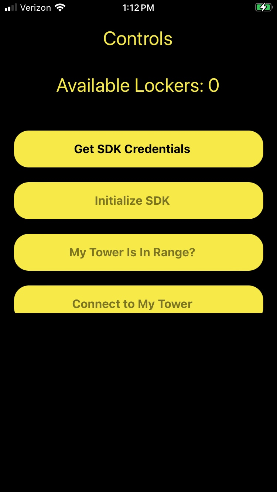

# Harbor SDK React Native Reference

This project was created with React Native 0.74.5

If you have any issues getting this App or your App running: check our [Harbor Documentation](https://docs.harborlockers.com/how_harbor_works.html)

## Credentials setup

Create a file called `credentials.js` using the template in `credentials-example.js`.

Fill in your `credentials` along with your desired sdk environment.

```
CLIENT_NAME:   '', // Your client id.
CLIENT_SECRET: '', // Your client secret.
SDK_ENV:       '', // Either sandbox, dev, or production. Case sensitive, all lowercase.
MY_TOWER_ID:   '', // fill with your tower id, it should be a 16 hexadecimal digit id
```

If you are missing any of these credentials, please contact us.

> **IMPORTANT** Make sure bluetooth is enabled on your device and port 8081 is available. 

## Running the App on IOS

### Requirements

1. Physical IOS device with bluetooth capabilities.
    An ios simulator will not work due to bluetooth requirements. Make sure that [Developer mode](https://developer.apple.com/documentation/xcode/enabling-developer-mode-on-a-device) is enabled on your device.
2. A Mac Computer
3. Install [Xcode](https://apps.apple.com/us/app/xcode/id497799835?mt=12) This project is set to Xcode version 15.
4. Make sure you have [Homebrew](https://brew.sh/) installed, then run the following commands in your [Terminal](https://support.apple.com/guide/terminal/open-or-quit-terminal-apd5265185d-f365-44cb-8b09-71a064a42125/mac)

Install the required software running the following commands on a terminal:

```
brew install node
brew install watchman
brew install cocoapods
brew install yarn
```

### Setup

1. Clone the repository.
2. Go to the project's root folder `/` and install the dependencies by running in your terminal:
    ```
    yarn install
    ```
3. Go to the `/ios` directory and install the dependencies by running in your terminal:
    ```
    cd ios
    pod install
    ```

    Go back to the root folder in the terminal:
    ```
    cd ..
    ```
4. [Set your personal development team](https://stackoverflow.com/questions/65680642/xcode-error-signing-for-requires-a-development-team) 
5. Build and run:
    - Connect your phone with a USB to your mac.
    - Install all the required dependencies that are prompted by Xcode (if any).
    - [Run the build](https://developer.apple.com/documentation/xcode/building-and-running-an-app)
    - You should see the app running on your phone after a short delay.


## Running the App on Android
    Requirements

1. Physical Android device with bluetooth capabilities.
    An android simulator will not work due to bluetooth requirements. Make sure that [Developer mode](https://developer.android.com/studio/debug/dev-options) is enabled on your device.
2. A computer (running any operating system)
3. Install [Android Studio](https://developer.android.com/studio)
4. Make sure you have [Node.js](https://nodejs.org/en) installed.

##### Setup

1. Clone the repository.
2. Go to the project's root folder `/` and install the dependencies by running in your terminal:
    ```
    yarn install
    ```
3. Build and run from Android Studio
    - [Pair your phone to android studio with WIFI](https://developer.android.com/codelabs/basic-android-kotlin-compose-connect-device#0) or [connect your phone with a USB cord and enable USB debugging](https://developer.android.com/studio/debug/dev-options)
    - [Sync your gradle files](https://stackoverflow.com/questions/29565263/android-studio-how-to-run-gradle-sync-manually) if it does not happen automatically. This project is using Gradle 7.6.3
    - [Run the app from android studio ](https://developer.android.com/studio/run/)

    You should then see the app running on your phone


## Using the App
When the app starts to run you should see the following screen.

</img>

While using the App, there will be a small delay before you are able to press the next button as the API call needs time to complete.
From here press the buttons in the following order:


1. Get SDK Credentials
2. Initialize SDK
3. My Tower Is In Range?
4. Connect to tower (this will take a moment)
5. Get Available Lockers

Once you **get available lockers** you will see the lockers your tower has access to at the bottom side of the screen.

 <br />

You can press the locker's button to fire the lock.
